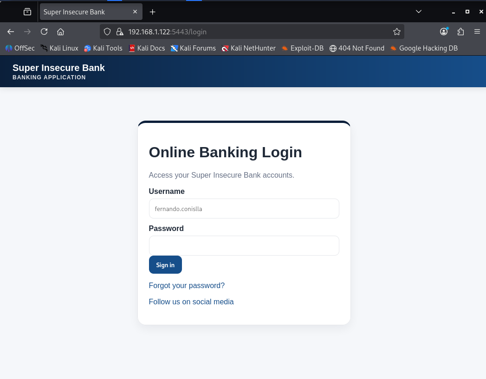

# Super Insecure Bank



**Super Insecure Bank** is an intentionally vulnerable banking web application created by **Fernando Conislla** for educational purposes.

This lab is designed to practice the identification, exploitation, and analysis of modern web application vulnerabilities aligned with **OWASP Top 10:2025**.

It simulates common digital banking features such as authentication, account lookup, transfers, account statements, password reset, receipts, security logs, and exposed internal services.

> **Warning:** this application contains intentional vulnerabilities. It must be executed only in controlled, local, or lab environments. It must not be exposed to the Internet or used as a real application.

---

## Requirements

Using **Kali Linux** as the working machine is recommended.

Install Docker and Docker Compose:

```bash
sudo apt update
sudo apt install -y docker.io docker-compose-plugin
sudo systemctl enable docker --now
```

---

## Installation and Deployment

### 1. Download the project

```bash
git clone https://github.com/seguridadcero/super-insecure-bank.git
cd super-insecure-bank
```

### 2. Build the lab

```bash
sudo docker compose build --no-cache
```

This command builds the Docker image. Use it the first time, after updating the project, or whenever you need to rebuild the environment from scratch.

### 3. Start the application

```bash
sudo docker compose up
```

This command starts the lab and shows the logs in the terminal.

Stop the lab and remove volumes:

```bash
sudo docker compose down -v
```

---

## How to Access the Lab

From the same machine where Docker is running:

```text
http://127.0.0.1:5080
https://127.0.0.1:5443
```

From another machine on the network, use the **IP address of the device where Docker is running**.

To get the device IP address:

```bash
ip -4 addr
```

Example:

```text
http://192.168.1.122:5080
https://192.168.1.122:5443
```

---

## Initial Credentials

```text
Username: fernando.conislla
Password: password1
```

---

# OWASP Top 10:2025 Scenarios

## A01:2025 — Broken Access Control

### Lab 1 — Access to another account’s information

The application allows bank users to view their own accounts and transactions.

Would it be possible to view the transactions of other users, such as Alice in account 2002?

### Lab 2 — Hidden loan functionality

The loan section indicates that this procedure must be completed in person.

Would it be possible to request a loan from the application?

### Lab 3 — Modification of a sensitive profile field

The application allows users to modify some profile information.

Would it be possible to modify the phone number used to receive OTP codes?

---

## A02:2025 — Security Misconfiguration

### Lab 4 — Exposed internal information

The application has a route used to check the system status.

Would it be possible to access internal bank information without logging in?

### Lab 5 — Exposed diagnostic console

The application was deployed while keeping a diagnostic screen available.

Would it be possible to find an internal console accessible from the browser?

---

## A03:2025 — Software Supply Chain Failures

### Lab 6 — Outdated third-party components

The application uses third-party components to operate.

Could it have outdated or vulnerable third-party components?

---

## A04:2025 — Cryptographic Failures

### Lab 7 — Insecure password storage

The application stores user passwords in an internal database.

Would it be possible to recover the original values of those passwords?

### Lab 8 — HTTPS channel with weak configuration

The application provides HTTPS access to protect communication between the user and the bank.

Would it be possible to identify whether the encrypted channel uses weak cryptographic configurations?

### Lab 9 — Weak secret for token generation

The application uses tokens to maintain the authenticated user session.

Would it be possible to create a valid token for another user?

---

## A05:2025 — Injection

### Lab 10 — SQL Injection in transaction search

The application allows users to search for movements within a bank account.

Would it be possible to manipulate the search to obtain more information than expected?

### Lab 11 — Command Injection in account statements

The application allows users to view their account statements.

Would it be possible to manipulate this functionality to execute commands on the server?

### Lab 12 — Cross-Site Scripting in receipts

The application allows users to write a note or reference when making a transfer.

Would it be possible to contaminate this field to execute arbitrary JavaScript code when the receipt is viewed?

---

## A06:2025 — Insecure Design

### Lab 13 — Inadequate design in commission charging

The application charges a commission for external transfers.

Would it be possible to avoid the commission charge when executing an external transfer?

---

## A07:2025 — Authentication Failures

### Lab 14 — User enumeration

The application allows interaction with different flows where usernames are processed.

Would it be possible to discover and validate valid usernames in the application?

### Lab 15 — Insecure password reset

The application allows password resets through a reset link sent to the user’s email.

Would it be possible to change another user’s password, for example Alice’s?

### Lab 16 — Login with insufficient defense and weak passwords

The login form allows different username and password combinations to be attempted.

Would it be possible to identify valid passwords for the application users?

---

## A08:2025 — Software or Data Integrity Failures

### Lab 17 — Receipt with manipulated data

The application generates a receipt after a transfer is made.

Would it be possible to generate receipts that are inconsistent with the real transactions?

---

## A09:2025 — Security Logging and Alerting Failures

### Lab 18 — Security logs exposing too much information

The application records events related to authentication and suspicious activity.

Would it be possible to identify excessive or sensitive information stored in the logs?

---

## A10:2025 — Mishandling of Exceptional Conditions

### Lab 19 — Inadequate error handling in transaction queries

The application receives account identifiers to query transactions.

Would it be possible to trigger an error that reveals internal system details?

---

## Credits

Super Insecure Bank is an intentionally vulnerable web application created by [Fernando Conislla](https://www.linkedin.com/in/fernando-conislla-murguia/) for educational purposes.<br>
Removing these credits may result in your bank account being mysteriously hacked.
